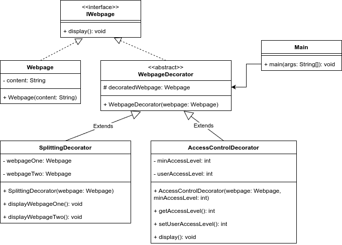

# Lab Assignment 6: Write a Java program to demonstrate the implementation of a decorator pattern for a web page, which might display complex behavior, such as only allowing access to authorized users, or splitting search results across multiple pages.

## Class Diagram

## Structure of the Program

1. `IWebpage` interface: names all the common methods for webpage.
1. `Webpage` class: implements the `IWebpage` interface with functionalities for the webpage.
1. `WebpageDecorator` abstract class: implements the `IWebpage` interface. A decorator class which extends the functionality of `Webpage`.
1. `SplittingDecorator` class: extends the `WebpageDecorator` abstract class. This class takes the webpage as input and splits its contents into two webpages (Here, all the contents of the website are just coppied to two websites).
1. `AccessControlDecorator` class: extends the `WebpageDecorator` abstract class. This class implements the functionality of access control for a webpage. If the user does not have the minimum required access level, then he cannot view the webpage.
1. `Main` class: contains the `main` method and demonstrates the decorator design pattern.

## Ouput
The output of the demo program can be found inside <a href="Out.txt">Out.txt</a>